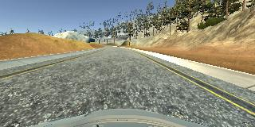
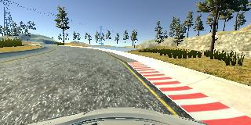
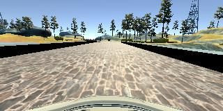
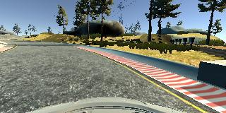
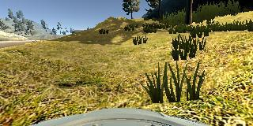
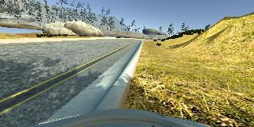

Behavioral Cloning
======


|Lake Track|
|:--------:|
||

## Description

The object of this project is to provide a neural network with a driving behavior that a simulator will then mimic. The pais (image, steering_value) are the network's (x_values, y_values) for the input and prediction. The problem then results in a "For a given scenario a steering angle 'x' should be applied".

Interesting is noticing that the network has absolutely no idea what it is doing, there's no information whatsoever about the practical application involved. 
The training images are taken from three different camera angles (center, left and right side of the car), providing more training information per frame.

### Files included

- `model.py` The training model for the behavioral cloning.
- `drive.py` Driver model - slightly modified from original version
- `model-03.h5` The model weights. (other .h5 present, best fit was 03)

## Model Architecture

The design is based on [the NVIDIA model](https://devblogs.nvidia.com/parallelforall/deep-learning-self-driving-cars/) - It's a deep convolution network optimised for image classification/regression problems. A Lambda layer was added first to normalize input images and avoid saturation.

The resulting model was:

- Lambda layer, image normalization
- Convolution layer:  24 filters, 5x5 kernel, 2x2 strides, activation: ReLu
- Convolution layer:  36 filters, 5x5 kernel, 2x2 strides, activation: ReLu
- Convolution layer:  48 filters, 5x5 kernel, 2x2 strides, activation: ReLu
- Convolution layer:  64 filters, 3x3 kernel, 1x1 strides, activation: ReLu
- Convolution layer:  64 filters, 3x3 kernel, 1x1 strides, activation: ReLu
- Flatten
- Fully connected:   100 neurons, activation: ReLu
- Fully connected:    50 neurons, activation: ReLu
- Fully connected:    10 neurons, activation: ReLu
- Fully connected:     1 neurons (output - steering value)

### Preprocessing

As suggested in class, images were cropped to cut the upper part that would only introduce error and noise to the CNN.

## Training, Validation and Test

### Training 
```python
python model.py
```
After completing all epochs, one or more `model-<epoch#>.h5` files could be output (if `save_best_only` was set to `True`), whenever the performance of the epoch is better than the previous best.
The training source consisted of two laps around the track. Tried staying on the right, but failing to do so and driving on both sides of the road probably got me better results since the edges of the road were more visible.
The loss function used is `mean_squared_error` and the optimizer used is `Adam` with a learning rate of 0.0009.
The number of epochs was set to 10, a higher value provided little to no improvement.
A test subgroup of 15% was selected for validation of each epoch. 

### Testing
```python
python drive.py model-03.h5 'data/output/'
```
### Samples


## Results

I chose this output video because, although it drove pretty much on the edge of the road a few times, it also includes a return-to-track after deviating very far off on a right-curve with a very high steering value. It shows a flaw in detection but a great response capability later on.

- [Lake Track](docs/output.mp4)
